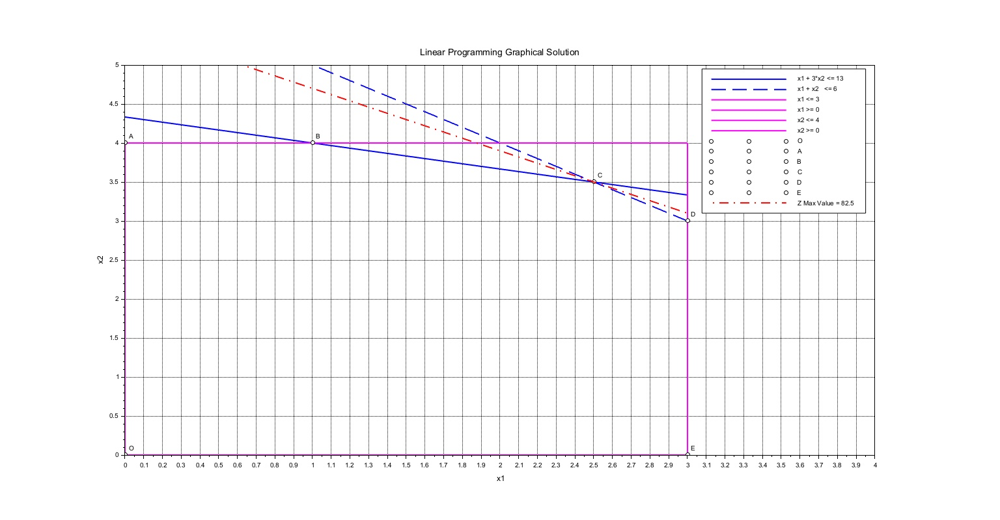

# Graphical Solution  

## [Scilab[1] Example](https://www.scilab.org  ) 

## [GeoGebra[2] Example](https://www.geogebra.org/calculator/csv6sfhv)

# References
1. Scilab Enterprises, Scilab: Free and Open Source Software for Numerical Computation. [Online]. Available: https://www.scilab.org  
2. A. Damasceno, “Linear Programming - Graphical Solution,” GeoGebra, [Online]. Available: https://www.geogebra.org/calculator/csv6sfhv. [Accessed: Sep. 10, 2025].