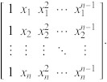

# Ordinary Least Squares (OLS) Formulas

* e = error  
* x = dependent variable  
* y = independent variable
* $a_{0}$ = intercept  
* $a_{1}, a_{2}, ..., a_{n}$ = coefficients  

$y = a_{0} + a_{1}x + a_{2}x^{2} + ... + a_{n}x^{n} + e$

X = Vandermonde Matrix [Ref 1]  

$\hat{a} = [a_{0}, a_{1} , ..., a_{n} ]^{T}$

$X^{T}X \hat{a} = X^{T}Y$

## For 2 variables

$a₁ = \frac{n \sum{x_{i}y_{i}} - \sum{x_{i}y_{i}}}
           {n\sum{x_{i}^{2}} - (\sum{x_{i}})^{2} }$

$a₀ = \overline{y} - a₁\overline{x}$

References:

 1. Weisstein, Eric W. "Vandermonde Matrix." From MathWorld--A Wolfram Web Resource. https://mathworld.wolfram.com/VandermondeMatrix.html 