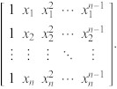

# Ordinary Least Squares (OLS) Formulas

* e = error  
* x = dependent variable  
* y = independent variable
* $a_{0}$ = intercept  
* $a_{1}, a_{2}, ..., a_{n}$ = coefficients  

$y_i = a_{i0} + a_{i1}x_1 + a_{i2}x_{2} + ... + a_{in}x_{n} + e_i$

X = Vandermonde Matrix [Ref 1]  

$\hat{a} = [a_{0}, a_{1} , ..., a_{n} ]^{T}$

$X^{T}X \hat{a} = X^{T}Y$

$\hat{a} = (X^{T}X)^{-1}X^{T}Y$

## For 2 variables

$a_{1} = \frac{\sum_{i=1}^n (x_i - \bar{x})(y_i - \bar{y})}{
                    \sum_{i=1}^n (x_i - \bar{x})^2}$  

$a₀ = \overline{y} - a₁\overline{x}$

References:

 1. Weisstein, Eric W. "Vandermonde Matrix." From MathWorld--A Wolfram Web Resource. https://mathworld.wolfram.com/VandermondeMatrix.html 